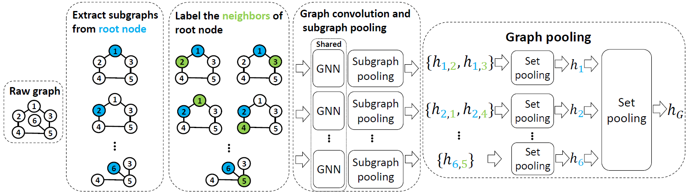

# Boosting the Cycle Counting Power of Graph Neural Networks with I$^2$-GNNs

**[IMPORTANT UPDATE]** There was an incorrect ground-truth labeling for raw data "./data/count_graphlet/raw/data.mat" in the version before 2023/3/17. We corrected the labels in this repo and updated our experimental results. Sorry for any inconvenience and confusion.

## About
This repository contains the official code for the paper [Boosting the Cycle Counting Power of Graph Neural Networks with I $^2$-GNNs](https://arxiv.org/abs/2210.13978). 



*Message Passing Neural Networks (MPNNs) are a widely used class of Graph Neural
Networks (GNNs). The limited representational power of MPNNs inspires the study of
provably powerful GNN architectures. However, knowing one model is more powerful
than another gives little insight about what functions they can or cannot express. It is still
unclear whether these models are able to approximate specific functions such as counting
certain graph substructures, which is essential for applications in biology, chemistry and
social network analysis. Motivated by this, we propose to study the counting power of
Subgraph MPNNs, a recent and popular class of powerful GNN models that extract rooted
subgraphs for each node, assign the root node a unique identifier and encode the root
node’s representation within its rooted subgraph. Specifically, we prove that Subgraph
MPNNs fail to count more-than-4-cycles at node level, implying that node representations
cannot correctly encode the surrounding substructures like ring systems with more than
four atoms. To overcome this limitation, we propose I2-GNNs to extend Subgraph MPNNs
by assigning different identifiers for the root node and its neighbors in each subgraph. I2-
GNNs’ discriminative power is shown to be strictly stronger than Subgraph MPNNs and
partially stronger than the 3-WL test. More importantly, I2-GNNs are proven capable of
counting all 3, 4, 5 and 6-cycles, covering common substructures like benzene rings in
organic chemistry, while still keeping linear complexity. To the best of our knowledge,
it is the first linear-time GNN model that can count 6-cycles with theoretical guarantees.
We validate its counting power in cycle counting tasks and demonstrate its competitive
performance in molecular prediction benchmarks.*


## Requirements
The following dependencies are required for this project:
- python 3.9.12
- pytorch 1.11.0
- pytorch gemetric (pyg) 2.0.4
- tqdm 4.64.0
- networkx 2.8.2
- rdkit 2022.03.2
- ogb 1.3.3
- dgl 0.9.0


## Usages
### Counting graph substructures

This part empirically evaluates the stronger counting power of I2-GNNs compared to other subgraph GNNs.

To reproduce the counting results of I2-GNNs (Table 2, 3 in the paper), run

```
bash run_count.sh I2GNN
```

to execute training and test on all cycles and graphlets mentioned in the paper. Replace parameter "I2GNN" with "NGNN", "IDGNN", "GNNAK", "PPGN" and "GNN" to get the results for other baseline models.


### QM9

To reproduce the results of I2-GNN on QM9 (Table 4 in the paper), run:

```
bash run_qm9.sh
```

to execute training and test on all 12 targets of QM9. 


### ZINC

Download [ZINC dataset](https://data.dgl.ai/dataset/benchmarking-gnns/ZINC.pkl) and [ZINC-full dataset](https://data.dgl.ai/dataset/benchmarking-gnns/ZINC-full.pkl) and save under "data/zinc/raw" 
and "data/zinc-full/raw" respectively.

To reproduce the results of I2-GNN on ZINC (Table 5 in the paper), run:

```
bash run_zinc.sh zinc
```

To reproduce the results of I2-GNN on ZINC-full (Table 5 in the paper), run:

```
bash run_zinc.sh zinc-full
```


### OGBG-MOLHIV
To reproduce the results of I2-GNN on ogb-molhiv (Table 5 in the paper), run:

```
bash run_hiv.sh
```

## Reference

[https://arxiv.org/abs/2210.13978](https://arxiv.org/abs/2210.13978)

```
@article{huang2022boosting,
  title={Boosting the Cycle Counting Power of Graph Neural Networks with I $\^{} 2$-GNNs},
  author={Huang, Yinan and Peng, Xingang and Ma, Jianzhu and Zhang, Muhan},
  journal={arXiv preprint arXiv:2210.13978},
  year={2022}
}
```

If you have any question about the code, please feel free to contact Yinan Huang (yinan8114@gmail.com)!